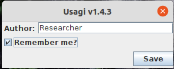
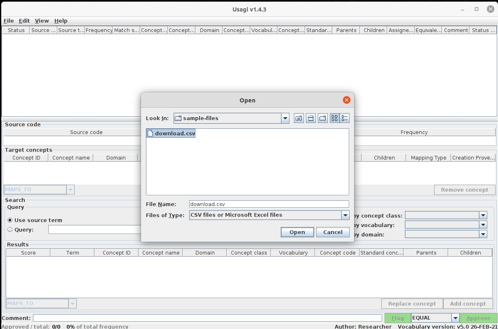

# Harmonization: custom coding mapping guide

Data harmonization is a central part in the Smart4Health project's data ingestion pipeline. It is designed to map
between _FHIR Coding_ and _OMOP Concept_. To improve the quality of the harmonization or to inject custom items, the
mapping table has to be supplemented by manual ones prepared by human professionals.

Usagi is a tool by _OHDSI_ that can be used for exactly this purpose: First import a CSV file with FHIR Coding text
columns, then query the OMOP CDM vocabularies for matching results with a sophisticated search algorithm and at last
review and approve those standardized mappings. More information is available at the official GitHub Pages
documentation: http://ohdsi.github.io/Usagi/index.html

The following document serves as a guide for these professionals.

## System requirements

- the Java Runtime Environment (JRE) in version 8, available for all operating systems: http://www.java.com
- the tool `curl` (should be available on Linux and Mac already): https://curl.se
- the file called `Usagi.zip` (~3 GB), not contained in this repository and has to be requested by the resource provider
- The credentials for accessing the service, not contained in this repository and has to be requested by the resource
  provider

## How To

### Process

#### 1. Download Codings

This will download a list of _unmapped_ Codings and store in the same directory as ths command prompt with the
filename `download.csv`. A password will be requested to enter.

```
curl -u coding -o download.csv -X GET 'https://qomop.dev.healthmetrix.com/v1/harmonization-config/coding/export?all=false'  
```

#### 2. Run through OMOP

1. Extract the Usagi.zip
2. Double-click the `Usagi_vx.x.x.jar` or run the file with the terminal: `java -jar Usagi_v1.4.2.jar`
3. Enter an arbitrary Author if asked
4. `File` -> `Import codes` (or Ctrl+I) and open the previously downloaded `download.csv`
5. In the bottom left, assign the fields as follows: \
   `Source code column` -> `source_code`\
   `Source name column` -> `source_name`\
   `Source frequency column` -> `source_frequency`\
   `Additional info column` -> `source_system`
6. Optionally filter the upcoming search in the bottom right by vocabularies, e.g. `SNOMED`, `LOINC` or `RxNorm`
7. Click the green `Import` button, this will trigger the search and will take 1-2 seconds per entry.
8. Process entries and eventually approve some of them (see [Help on approving codes](#help-on-approving-codes)).
9. Use `File`->`saveAs` and store in a directory with the name `upload.csv`
10. You may also at a later point return to this process by using not `File` -> `Import codes`, but `File` -> `Open` (
    Ctrl+O)

#### 3. Upload Codings

From the directory where also the `upload.csv` is located, run the following command. A password will be requested to
enter:

```
curl -u coding -X POST 'https://qomop.dev.healthmetrix.com/v1/harmonization-config/coding/import' -F 'file=@"upload.csv"'
```

The output of this command is a JSON formatted list of imported and skipped items. For an example
see [sample_import_response.json](sample-files/sample_import_response.json). Note that items will be skipped if:

- the item was not marked with the green `Approve` button. As of now the dropdown left of it (`EQUAL`, `WIDER` etc.) is
  not checked
- the target vocabulary is NOT one of these: `SNOMED`, `LOINC` or `RxNorm`
- the assigned conceptId is empty, has value `0` or is not available in the server's vocabulary copy

The mappings that are imported can also be imported again, invalidating the previous version and maintaining
traceability so in case of wrongful mappings, reverting to the previous one is always possible. This last process has
not been automated yet and must be done manually.
See [Reverting and reviewing mappings](#reverting-and-reviewing-mappings).

## Help on approving codes

There is a documentation with more information regarding processing the imported codes
http://ohdsi.github.io/Usagi/usage.html

Because the screenshots are not fully updated, here a textual guide that should complement the documentation by looking
at one item in the list:

First we can expect that Usagi will provide as at least with one suggestion for a mapped Concept. They are listed in
the `Results` section in the bottom third of the screen. The `Score` reflects a floating-point number between 0 and 1
with 1.0 being the best matching. However, this value only reflects a match _within_ the other results, so it can
definitely be that the first one is _not_ the best matching one which is also why this processed is not automated, but
should be done by a professional being aware of the OMOP CDM structure.

The columns `Term`, `Concept name`, `Domain`, `Concept class` and `Standard Concept` are especially important to
preserve semantic equivalence of the mapped items.

The chosen OMOP Concept mapping can be activated by clicking the green `Approve` button in the bottom right. The
dropdown next to it should be ignored. All approved items, no matter the reason, will be processed later.







## Reverting and reviewing mappings

To acquire not only the unmapped Codings, but all of them (e.g. to revert a specific one), follow
step [1. Download Codings](#1-download-codings) and in the URL, replace the query parameter `all=false` with `all=true`.
The `download.csv` file will contain all existing entries (both unmapped and mapped) and can be reduced to the ones that
have to be processed with Usagi manually.

## Troubleshooting

### Re-indexing Usagi

The `Usagi.zip` file contains a copy of the indexed vocabularies. If this database has to be re-indexed (error messages
will indicate this), then follow this procedure:

1. Acquire the zipped vocabularies from the resource provider and extract them to a directory called e.g. `vocabularies`
2. Close Usagi
3. Delete all files and directories from the Usagi directory except the jar file (`Usagi_vx.x.x.jar`)
4. Start Usagi, it will ask for the vocabulary directory to re-index. Point it to `vocabularies`
5. Indexing will take place and can take up to or more than 1 hour depending on the system's resources
6. When finished, Usagi will ask to restart itself for the actions to take place